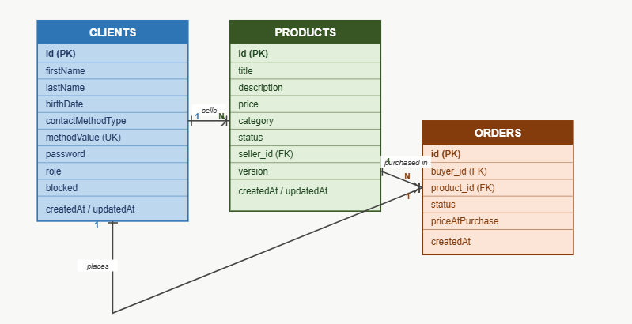

# Phoenix Project

A RESTful backend API for a marketplace, built as a modular monolith where users can buy and sell products..
**As a Seller** you can list products for sale, manage your listings, and update or remove them at any time.
**As a Buyer** you can browse available products, search by name, category or price, and purchase items from other sellers.
**As an Admin** you can manage users, block accounts, change roles, remove problematic products, and view system statistics.
The system prevents buying your own products, double purchases, and unauthorized modifications to other users' listings.

## Tech Stack

- Java 17
- Spring Boot 3.5
- Spring Security + JWT
- Spring Data JPA
- H2 In-Memory Database
- JUnit 5 + Mockito
- Swagger UI

## Access

- API: http://localhost:8080
- Swagger: http://localhost:8080/swagger-ui/index.html
- H2 Console: http://localhost:8080/h2-console

## Default Users (password: `password123`)

| Name | Email | Role |
|------|-------|------|
| Mor Biton | mor@phoenix.com | ADMIN |
| Dani Cohen | dani@test.com | USER (seller) |
| Tomer Adar | tomer@test.com | USER (buyer) |

## ERD

## Modules

- `auth` - Register and login
- `client` - User profile
- `product` - Product management
- `order` - Purchase flow
- `admin` - Admin operations
